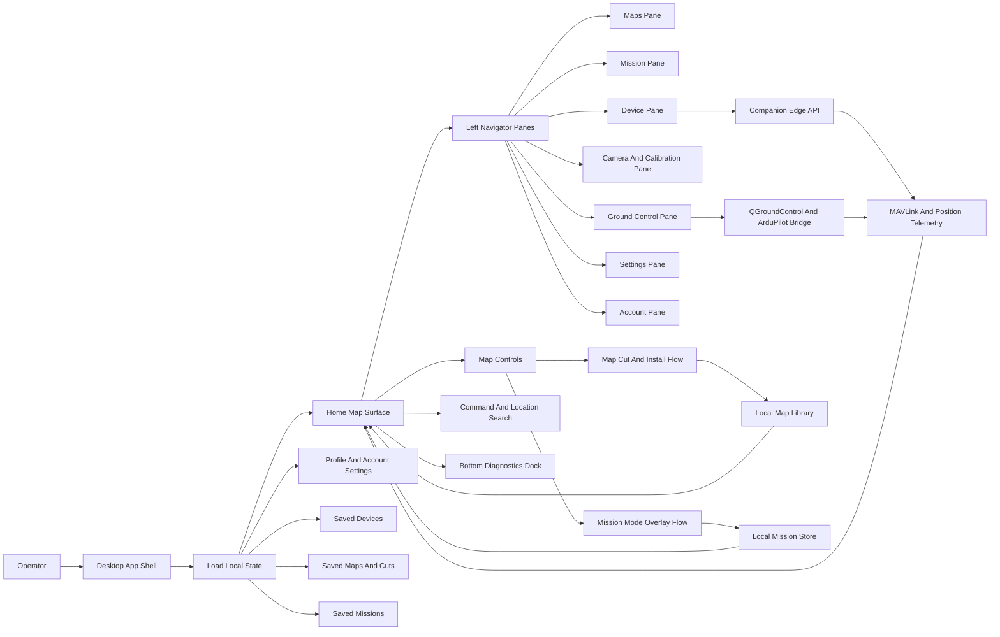
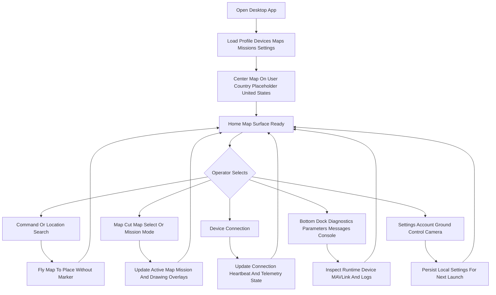
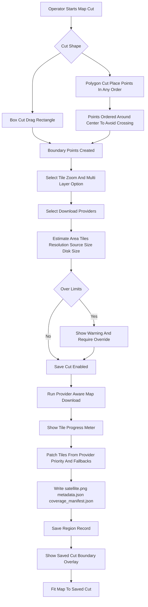
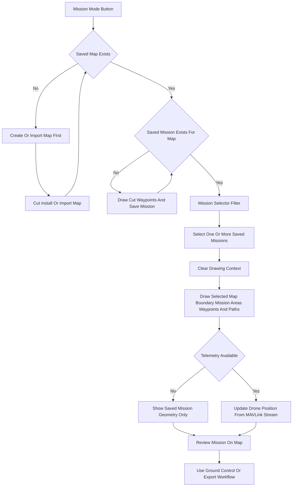
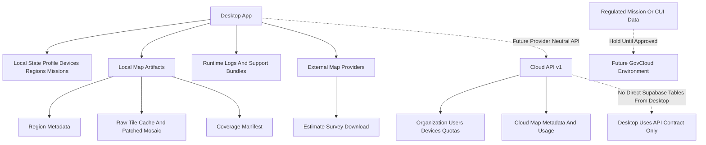

# App Process Map

This document maps the desktop app as an operator workflow. It focuses on the current streamlined shell: map-first home surface, left navigator panes, right map and mission controls, bottom diagnostics, device connectivity, map installation, mission overlays, and future cloud boundaries.

## Overall App Flow

## Launch And Navigation

## Map Cut And Installation

## Mission Mode

## Device Connectivity And Telemetry

```mermaid
flowchart LR
  DevicePane["Device Pane"] --> DeviceSetup{"Connection Method"}
  DeviceSetup --> Automatic["Automatic Discovery"]
  DeviceSetup --> Custom["Custom IP Username Password"]

  Automatic --> EdgeCandidate["Find Companion Computer"]
  Custom --> EdgeCandidate
  EdgeCandidate --> SaveDevice["Save Active Device"]
  SaveDevice --> EdgeHealth["Check Edge API Health"]
  EdgeHealth --> Heartbeat["Heartbeat Probe"]
  Heartbeat --> Mavlink["MAVLink Endpoint"]

  Mavlink --> PositionBridge["Position UDP Or Edge API Position"]
  PositionBridge --> Dashboard["Dashboard Aircraft Position"]
  Mavlink --> Gcs["QGroundControl Mission Planner ArduPilot"]
  Gcs --> PositionBridge
  EdgeHealth --> Runtime["Runtime Services Camera Calibration Diagnostics"]
  Runtime --> BottomDock["Bottom Dock Evidence"]
```

## Data And Storage Boundaries

## Primary Operator Path

```mermaid
flowchart LR
  A["Launch App"] --> B["Connect Device"]
  B --> C["Confirm Heartbeat"]
  C --> D["Create Import Or Select Map"]
  D --> E["Estimate And Install Map"]
  E --> F["Draw Waypoints And Save Mission"]
  F --> G["Enable Mission Mode For Saved Map"]
  G --> H["Monitor Live Telemetry"]
  H --> I["Review Logs And Diagnostics"]
  I --> J["Export Support Or Mission Artifacts"]
```

## Process Notes

- The home map is the primary work surface.
- Left navigator panes expose workflows, but the map remains the operational context.
- Mission Mode is gated: at least one saved map must exist before Mission Mode can activate.
- A saved mission should be tied to a saved map so mission overlays always have a known map boundary.
- Saved map cuts should always render their boundary overlay when selected.
- Save Cut is an installation process, not just metadata persistence.
- Mission Mode shows saved mission geometry and then layers live telemetry when available.
- Ground Control integrations should feed the app telemetry state rather than becoming a separate operator silo.
- Cloud integration should remain provider-neutral through `/v1` APIs so commercial prototype services can later migrate to GovCloud.
